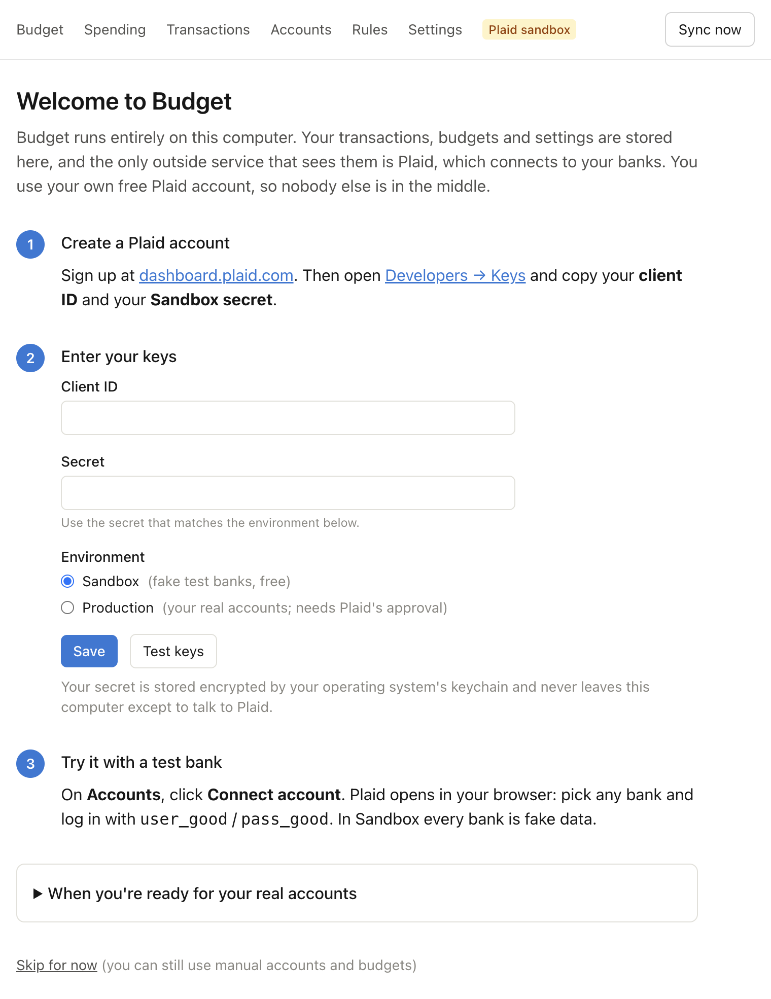
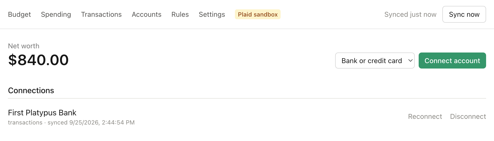
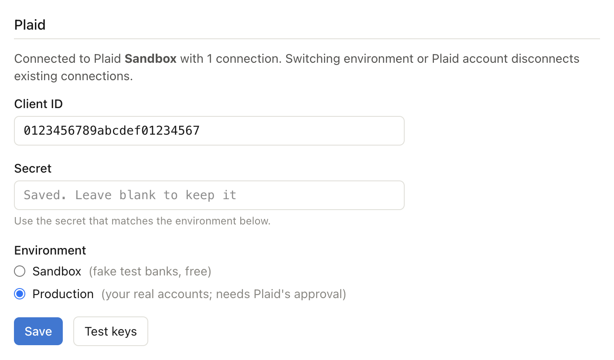

# Setting up Plaid

Budget connects to banks through [Plaid](https://plaid.com). You use **your own** Plaid account, so
your bank data goes only between your computer, Plaid and your bank. This guide takes you from
signing up to seeing your real accounts.

Plaid's dashboard changes from time to time, so menu names may differ slightly from what's here.

## 1. Create a Plaid account

1. Sign up at [dashboard.plaid.com/signup](https://dashboard.plaid.com/signup). Signing up and using
   Sandbox are free.
2. Turn on two-factor authentication for your Plaid login. Your Plaid keys can read your bank data,
   so protect them like a bank password.

## 2. Try it with Sandbox (fake data)

Sandbox is Plaid's test environment. Every bank in it is fake, so it's a safe way to try the app.

1. In the dashboard, open **Developers → Keys**.
2. Copy your **client ID** and your **Sandbox secret**.
3. In Budget, enter them on the setup page (or **Settings**), choose **Sandbox**, and click **Save**.
   Running from source instead? Put them in `.env.local` as `PLAID_CLIENT_ID` and `PLAID_SECRET`
   with `PLAID_ENV=sandbox`.

   

4. On **Accounts**, click **Connect account**. Plaid opens in your browser. Pick any bank and log in
   with `user_good` / `pass_good`. For a larger, more realistic data set, use
   `user_transactions_dynamic` with any password.

   

   Choose the connection type in the menu first: **Bank or credit card**, **Investments** or
   **Mortgage / loan**. While you're on Sandbox, the top bar shows a **Plaid sandbox** badge.

## 3. Get Production access (your real accounts)

1. In the dashboard, request **Production** access. Plaid asks about your use case: a personal
   budgeting tool for yourself is the honest answer.
2. Request only the products you'll use:

   | Product | What it's for in Budget |
   |---|---|
   | **Transactions** | Checking, savings and credit card accounts and their transactions |
   | **Investments** | Brokerage, IRA and 401(k) balances |
   | **Liabilities** | Mortgages and other loans |

3. Check what Production costs for you. Plaid has offered a limited free tier for a small number of
   connections, but plans and prices change. Each bank login you connect counts as one connection.
4. **OAuth banks:** some large banks connect through their own login page and require Plaid's
   OAuth registration. Complete your company/application profile in the dashboard and check the
   OAuth page for each bank's status. Approval can take a few days, and a bank may not appear in
   Plaid Link until it's done.

## 4. Switch Budget to Production

1. Copy your **Production secret** from **Developers → Keys** (the client ID stays the same).
2. In Budget's **Settings**, choose **Production**, paste the Production secret and click **Save**.
   Sandbox connections are removed, because they don't work with Production keys. Budgets, rules
   and manual accounts are kept.
   From source: stop the app, run `npm run reset-data -- --yes`, then set `PLAID_ENV=production`
   and the Production `PLAID_SECRET` in `.env.local`.

   

3. Connect each bank **once**. To add more accounts from a bank you've already connected, use
   **Reconnect** on that connection instead of connecting it again. That avoids using up another
   connection.

## Troubleshooting

- **"Invalid API keys":** the secret doesn't match the environment. Sandbox and Production have
  different secrets. Use **Test keys** in Settings to check.
- **A bank says your browser isn't supported:** the desktop app opens bank logins in your default browser.
  Make sure it's an up-to-date Chrome, Safari, Firefox or Edge.
- **A bank asks you to log in again:** click **Reconnect** on **Accounts**. Your history is kept.
- **A bank won't connect** (for example, a verification code never arrives): add it as a manual
  account on **Accounts** and update its balance now and then.
- **Transactions show as "Other" right after connecting:** Plaid is still categorizing them. Click
  **Sync now** again after a few minutes.
